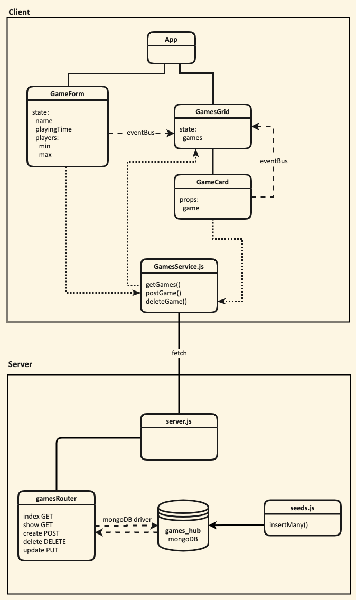

# Task
> Draw a diagram showing the dataflow through the application starting with a form submission, ending with the re-rendering of the page. This will involve a multi-direction data-flow with the client posting data to the server and the server sending data back to the client with the response. Detail the client, server and database in the diagram and include the names of the files involved in the process.

## Questions
1. What is responsible for defining the routes of the `games` resource?
> The base route is passed into `app.use()` along with the helper function defined in `create_router.js`. `create_router.js` is responsible for managing the RESTful routes for the base route.

2. What do you notice about the folder structure? What's the client responsible for? What's the server responsible for?
> The client (front end) and server (back end) are separated in the top-level directory. The client is responsible for displaying the data to the user and accepting user input. The server is responsible for passing data to and from the database and sending/receiving data from the client.

3. What are the the responsibilities of `server.js`?
> `Server.js` is responsible for configuring the backend server and passing client fetch requests to `gamesRouter`.

4. What are the responsibilities of the `gamesRouter`?
> The `gamesRouter` is responsible for taking a client request and talking to the database depending one which route was hit. It then responds back to the client.

5. What process does the the client (front-end) use to communicate with the server?
> The client passes all data requests to `GamesService.js` which initiates a fetch request to the server.

6. What optional second argument does the `fetch` method take? And what is it used for in this application? Hint: See [Using Fetch](https://developer.mozilla.org/en-US/docs/Web/API/Fetch_API/Using_Fetch) on the MDN docs
> The optional second argument is a configuration object for controlling a number of different settings such as request method, body, and headers.

7. Which of the games API routes does the front-end application consume (i.e. make requests to)?
> "/" index (GET)
>
> "/" create (POST)
>
> "/:id" delete (DELETE)

8. What are we using the [`MongoDB Driver`](http://mongodb.github.io/node-mongodb-native/) for?
>We need the MongoDB driver to connect to and send commands to the database.

## Extension
1. Why do we need to use [`ObjectId`](https://mongodb.github.io/node-mongodb-native/api-bson-generated/objectid.html) from the MongoDB driver?
> An ObjectId is a special type of Object not native to javascript that is needed to reference a document ID in the database. Creating an ObjectId instance allows MongoDB to find a match for that ID in the database.

---
## Dataflow

